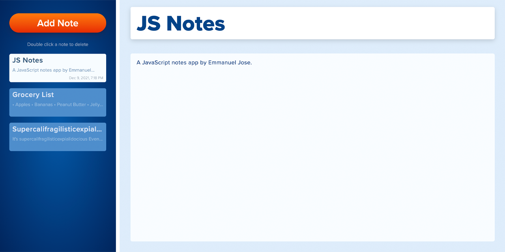
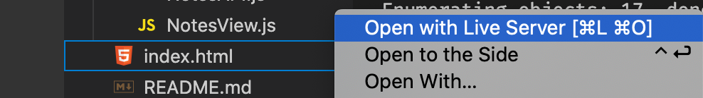

<p id="header"><p>

<table><tr>
<td> <a href="https://github.com/emjose/take-a-guess/#header"></a> </td>
<td> <a href="https://github.com/emjose/one-hundred/#header"></a> </td>
<td> <a href="/#header"></a> </td>

</tr></table>

<br>

<p id="project-title"><p>

<a href=#table-of-contents></a>

<br>

<a href="https://js-notes-app.vercel.app/"></a>

#

<p id="table-of-contents"><p>

<a href=#table-of-contents></a>

-   [100 Days of Code](#100days)
-   [Installation](#installation)
-   [Live Site](#live-site)
-   [Resources](#resources)
-   [Let's Connect!](#lets-connect)

#

<p id="100days"><p>

<a href=#100days></a>

### Day 32: December 9, 2021

-   To focus on <a href="https://www.codecademy.com/article/what-is-crud">CRUD</a>, I worked on a JavaScript notes app based on a <a href="https://youtu.be/01YKQmia2Jw">tutorial</a> by <a href="https://www.youtube.com/dcode-software">dcode</a>.
-   The app is keyboard accessible and has an adjustable sidebar with usage of <a href="https://interactjs.io/">Interact.js</a>.
-   The app uses local storage for data persistence and <a href="https://developer.mozilla.org/en-US/docs/Web/JavaScript/Guide/Modules">JavaScript modules</a> to render the HTML view.
-   **This app is best viewed on a desktop computer or a laptop**, using a Chrome, Firefox, or Edge browser.

#

<p id="installation"><p>

<a href=#installation></a>

#### Git clone and cd into the repo folder:

```
git clone git@github.com:emjose/js-notes-app.git && cd js-notes-app
```

#### Right-click on the index.html file and select `Open with Live Server`



#

<p id="live-site"><p>

<a href="https://js-notes-app.vercel.app/"></a>

<a href="https://js-notes-app.vercel.app/"></a>

The sidebar is adjustable, and long titles and note contents are scrollable.
<br>
<br>
<a href="https://js-notes-app.vercel.app/"></a>

• Local storage is used for data persistence, and notes can be viewed, added, and deleted.

• When a note is selected for deletion, a browser prompt appears for confirmation (not captured by GIF recording).
<br>
<br>
<a href="https://js-notes-app.vercel.app/"></a>

Notes can be edited, and the list of notes are sorted by most recent timestamp of edits.

#

<p id="resources"><p>

<a href=#resources></a>

-   #### [Free Frontend](https://freefrontend.com/)

-   #### [What is CRUD?](https://www.codecademy.com/article/what-is-crud)

-   #### [Interact.js library](https://interactjs.io/)

-   #### [CSS Scan Box Shadow Examples](https://getcssscan.com/css-box-shadow-examples)

-   #### [Supercalifragilisticexpialidocious](https://www.youtube.com/watch?v=uZNRzc3hWvE)

-   #### [Build a Notes App Tutorial](https://www.youtube.com/watch?v=01YKQmia2Jw) by [dcode](https://www.youtube.com/channel/UCjX0FtIZBBVD3YoCcxnDC4g)

-   #### [Adjustable Sidebar Examples on CodePen](https://codepen.io/search/pens?q=adjustable+sidebar&order=created_desc)

-   #### [My blog on how I created my Github READMEs](https://emmanueljose.medium.com/readme-a-makeover-story-b9c7be37a6de?sk=7ae6623d365409d875753e4604e42ffd)

#

<p id="lets-connect"><p>

<a href=#lets-connect></a>

<p><a href="https://twitter.com/Emmanuel_Labor"> <a href="https://www.linkedin.com/in/emmanuelpjose/"> <a href="https://emmanueljose.medium.com/"> <a href="https://www.instagram.com/emmanuel_jose/"> <a href="mailto:emjose@gmail.com"> <a href="https://www.emmanuel-jose.com/"> <a href="https://github.com/emjose"></p>

#

<a href=#header></a>
